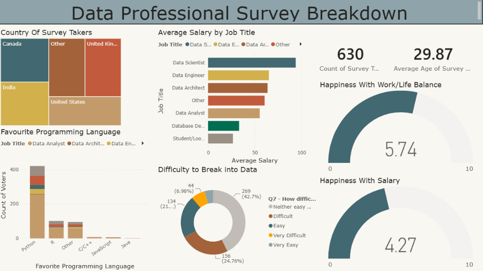

# 📊 Data Professional Survey Dashboard

An interactive Power BI dashboard analyzing survey responses from data professionals to explore salaries, job roles, programming languages, demographics, and career satisfaction.

## 🎯 Objective

Analyze survey data to understand:

- Salary differences across data-related job roles
- Most popular programming languages
- Geographic distribution of survey respondents
- Work/life balance and salary satisfaction
- Perceived difficulty of entering the data field

## 🛠️ Tools Used

Power BI · Excel

## 🔄 Workflow

Raw Survey Data → Data Cleaning → Power BI Analysis → Interactive Dashboard

## 📊 Dashboard

The dashboard contains:

- Country distribution of survey respondents
- Average salary by job title
- Favourite programming languages
- Work/life balance satisfaction
- Salary satisfaction
- Difficulty of breaking into data
- Survey response and demographic KPIs

## 🔍 Key Insights

- The survey contains **630 responses** with an average respondent age of **29.87 years**.
- **Data Scientists** have the highest average salary among the displayed job roles.
- **Python** is the most popular programming language among survey respondents.
- Most respondents rated breaking into the data field as **neither easy nor difficult**.
- Average happiness with work/life balance was **5.74/10**.
- Average happiness with salary was **4.27/10**.

## 📁 Project Files

- `Data Professional Survey.pbix` — Power BI dashboard
- `survey.xlsx` — cleaned survey dataset

## 📸 Dashboard Preview

